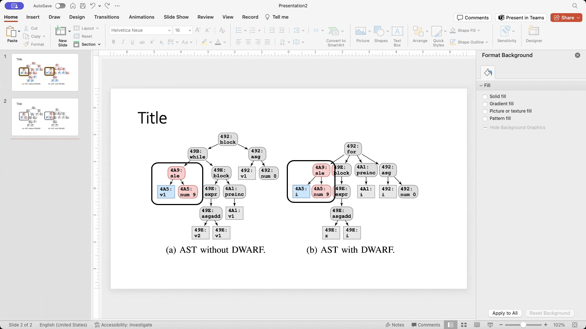

The purpose of this repository is to document powerpoint tips for researchers like myself (but hopefully useful to others too!).

An important part of being a researcher is communicating your work to others.  As a result, a necessary evil is spending a lot of time making powerpoint presentations.  My motivation for creating this repository is to encourage myself to spend time to find the right way to accomplish many of the tasks that I perform.  I expect that, eventually, this repository will include Macros and scripts.  I'm a bit embarassed to say that while I spend a lot of time programming *and* creating powerpoint presentations, I almost never combine the two, which feels like a missed opportunity.

# How to contribute?

Open a pull request.  Give preference to scripts or videos using [gifcap](https://gifcap.dev/) where possible over text instructions.

# Tips

## How to emphasize part of an image?

The traditional solution is to draw a box around the emphasized portion of the image, but it's possible to do better.

The general idea is to use the "Fragment" merge shapes options in order to split the image into emphasized and non-emphasized pieces.  The non-emphasized pieces can be desatured in color, blurred, or something else.

### Desaturation example

### Blur example
This builds on the previous example.

